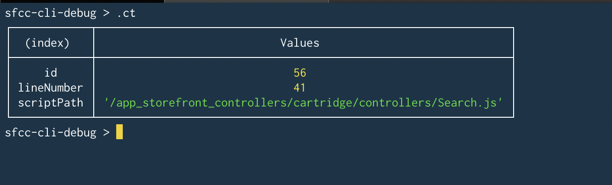
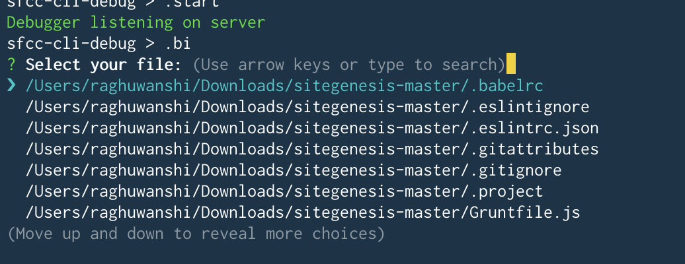
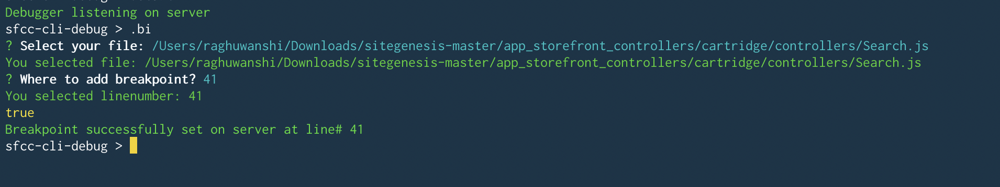
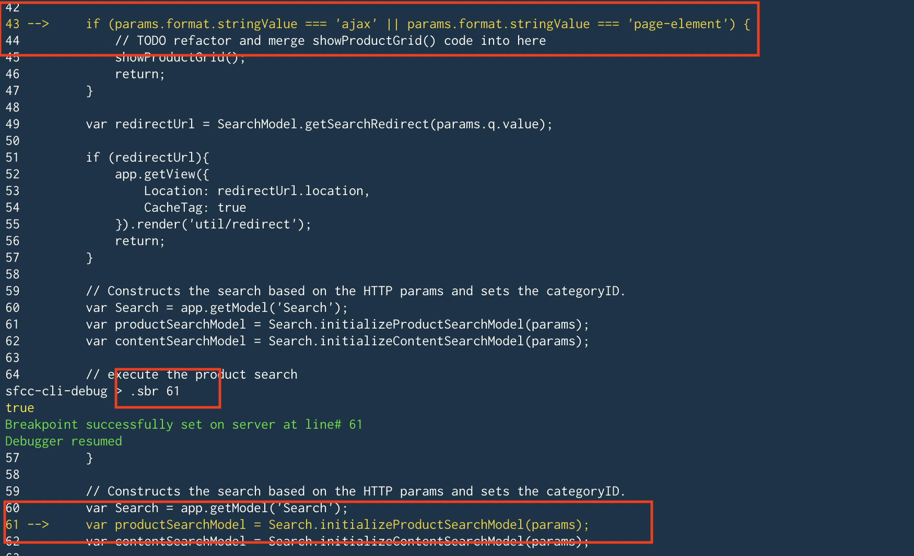
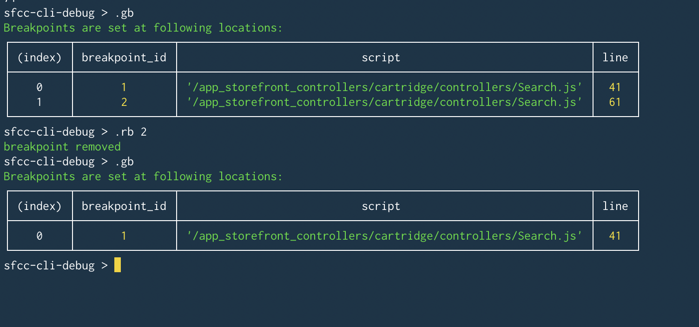
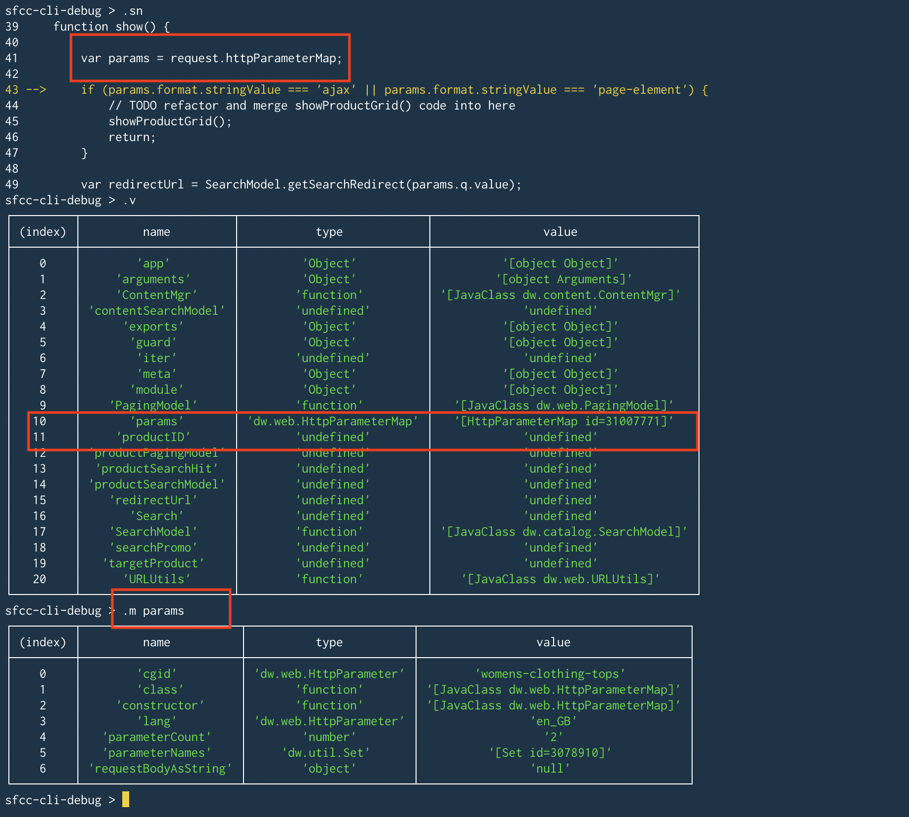
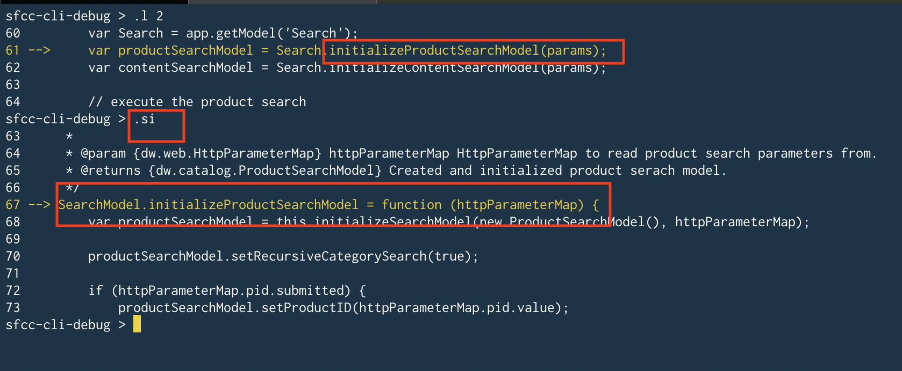
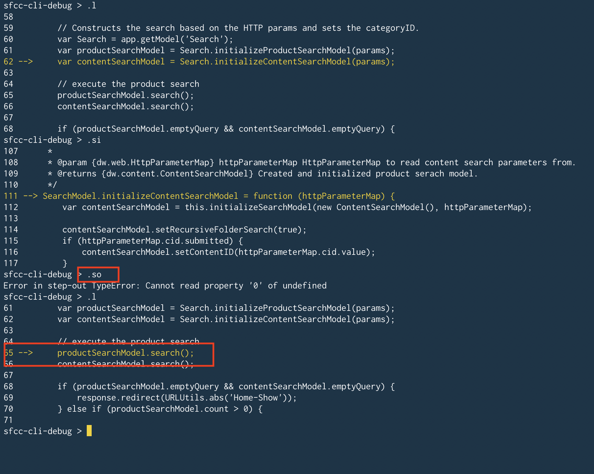
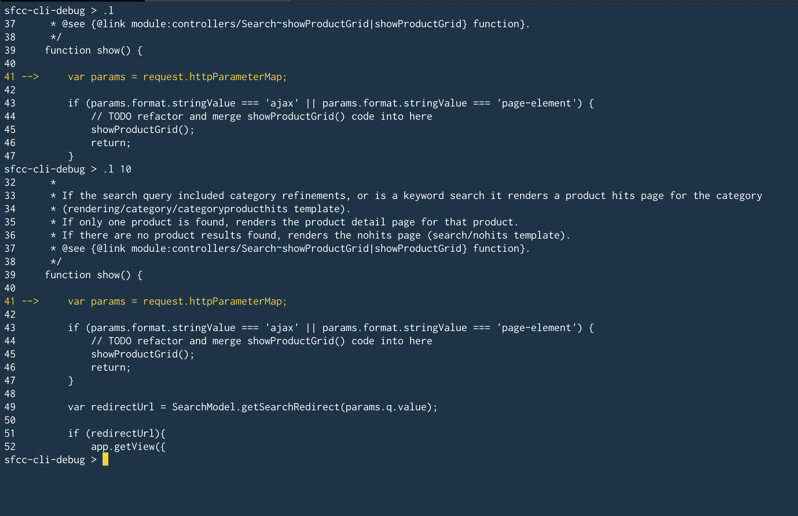
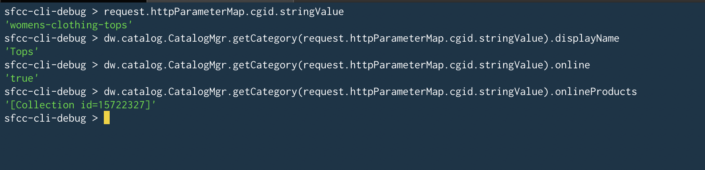

# Salesforce Command Line Debugger
An experimental command line debugger for Salesforce Commerce Cloud. This provides an interface similar to pdb debugger for python.

- [Installation](#installation)
- [Configuration](#configuration)
  * [Single Root Workspace](#single-root-workspace)
  * [Split Workspace](#split-workspace)
  * [Any other setup](#any-other-setup)
- [Usage](#usage)
  * [Connect Debugger](#connect-debugger)
  * [Disconnect Debugger](#disconnect-debugger)
  * [Check debugger halted](#check-debugger-halted)
  * [Add breakpoint](#add-breakpoint)
    + [Manually](#manually)
    + [Interactively](#interactively)
    + [Additional breakpoint commands](#additional-breakpoint-commands)
  * [Get Variables](#get-variables)
  * [Get member of variables](#get-member-of-variables)
  * [Step Over(Next)/Into/Out/Resume](#step-over-next--into-out-resume)
  * [Print source code](#print-source-code)
  * [Eval](#eval)
  * [Exit](#exit)
- [All Commands](#all-commands)

# Installation

Download/clone the repository & run `npm install` to install the dependencies. Node version `10.x` or greater is required.

# Configuration

Before starting to debug it is important to configure the debugger. The debugger configuration is part of `dw.json` and `config.js` file.

`dw.json` is the standard file which is used by various other SFCC tools. Add your instance hostname & credentials in it.

`config.js` is a custom configuration file. See `config.js.sample` for possible options.

Out of the box debugger supports two kinds of workspace setups.

## Single Root Workspace

In this setup all cartridges are under `/cartridges/` and under one parent folder as shown below.

```js
>> ~/clone/dummy_folder/storefront-reference-architecture
├── bin
├── cartridges
│   ├── app_storefront_base
│   ├── bm_app_storefront_base
│   └── modules
│   └── plugin_ratings
│   └── plugin_wishlist
│   └── int_klarna
└── test
    ├── acceptance
    ├── integration
    ├── mocks
    └── unit
```

This setup is quite easy to configure using `rootWorkSpacePath` property. 

In `config.js` configure `rootWorkSpacePath` as `/my_user/home/path/till/cartridges/`. So, for above example this will be `/Users/username/clone/dummy_folder/storefront-reference-architecture/cartridges`

## Split Workspace

This setup is similar to above but supports a hierarchy. This setup is best shown via below example.

```js
>> ~/clone/dummy_folder
.
├── integrations
│   └── link_klarnacheckout
│       ├── cartridges
│       │   ├── int_klarna_checkout
│       │   ├── int_klarna_checkout_core
│       │   └── int_klarna_checkout_sfra
├── plugins
│   ├── plugin_ratings
│   │   └── cartridges
│   │       └── plugin_ratings
│   └── plugin_wishlists
│       ├── cartridges
│       │   └── plugin_wishlists
└── storefront-reference-architecture
    ├── cartridges
    │   ├── app_storefront_base
    │   ├── bm_app_storefront_base
    │   └── modules
```

The above setup requires additional setup in `config.js` file.

`rootWorkSpacePath` - Configure this with the path of the parent folder which contains all your cartridges. So, in above example this would be `/Users/username/clone/dummy_folder`

`childWorkSpaces` - Configure this with the path of individual folders. So, in above example this would be

```js
        childWorkSpaces: [
            '/Users/username/clone/dummy_folder/integrations',
            '/Users/username/clone/dummy_folder/plugins',
            '/Users/username/clone/dummy_folder/storefront-reference-architecture'
        ]
        ...
```

## Any other setup

Any other setup like folders not sharing a common parent folder will work similar to setup #2 but `interactive breakpoint` feature which relies on single/common root path `rootWorkSpacePath` will not work as expected but you can always setup breakpoint manually by specifying the script path.

```js
        rootWorkSpacePath: '/Users/username/some/random/path/1'
        childWorkSpaces: [
            '/Users/username/some/random/path/1',
            '/Users/username/some/random/path/2',
            '/Users/username/some/random/path/3'
        ]
        ...
```

# Usage

Debugger is based on the [node](https://nodejs.org/api/repl.html#repl_replserver_definecommand_keyword_cmd) repl module.

Run the debugger script with below command.

```js
node debug.js
sfcc-cli-debug >
```

Debugger also support multiple configurations i.e. you can maintain different configurations per project and supply it at runtime through cli parameters. If no parameters are specified debugger fallbacks to standard `dw.json` and `config.js` file names.

```js
node debug.js --dwconfig ./dw.json --config ./config.js
```

After running the above command you will enter into a custom repl prompt `sfcc-cli-debug`. The commands recognized by the debugger are listed in the help section (.help).

Commands that the debugger prompt doesn't recognize are assumed to be SFCC code statements and are executed in the context of the program being debugged against SFCC server.

```js
sfcc-cli-debug > .help
.start    Attach a Debugger Client
.stop     Detach a Debugger Client
.b        Add a breakpoint
.break    Alias : Add a breakpoint
.bi       Add a breakpoint interactively
.sbr      Add a breakpoint and resume/continue
.ct       Get current thread
.v        Get Variables in scope
.m        Get members of variables
.l        print source code
.si       Step Into
.sn       Step Over/Next to next line
.so       Step Out
.r        Resume and halt at next breakpoint
.p        Evaluate On Server and print expression value
.gb       Display all breakpoints
.rb       remove breakpoint(s)
.exit     Exit the repl
```


## Connect Debugger
Use this command to connect/attach the debugger to your sandbox. This should be first command you run before starting the debugging session

```js
sfcc-cli-debug > .start
Debugger listening on server
sfcc-cli-debug >
```

## Disconnect Debugger
Use this command to stop the debugger connected/attached to your sandbox.

```js
sfcc-cli-debug > .stop
Debugger disconnected from server
sfcc-cli-debug >
```

## Check debugger halted

`.ct` command can be used to see at which location debugger is currently halted. This command can also be used to check if debugger is hit or not.

<br>

## Add breakpoint

Once your debugger is connected it is time to add breakpoint. There are two ways to add a breakpoint

### Manually

Use command `.b lineNumber,scriptPath` or `.break lineNumber,scriptPath`

lineNumber - line number where breakpoint will be added

scriptPath - Location of the `.ds or .js` file. This path should be after the `/cartridges` folder and is an absolute path with leading `/`.


```js
sfcc-cli-debug > .break 17,/app_storefront_controllers/cartridge/controllers/Home.js
Breakpoint successfully set on server at line# 17
sfcc-cli-debug >
```

### Interactively

Use command `.bi` and it will open an interactive prompt. In this prompt you can search(fuzzy) & select the file of your choice. 
After the file is selected you will be asked for lineNumber where breakpoint should be added.

<br>




### Additional breakpoint commands

It is not always an easy experience in cli, when while debugging you have to set breakpoints at multiple locations in the same file.
In order to make this a bit easy you can use the `.sbr lineNumber` command.

`.sbr` command takes only one argument the `lineNumber`. `Script Path` is assumed to be the current script where debugger is halted.
In this command debugger is also automatically resumed(`.r`) to the new breakpoint location.

<br>


`.gb` command can be used to list down all the breakpoints added on server

`.rb` command can be used to remove the breakpoints on the server. It takes an additional argument `breakpoint id` if a specific breakpoint has to be removed. If not specified all breakpoints are removed.
`breakpoint id` is returned as the response of `.gb` command

<br>

## Get Variables

Debugging experience without inspecting the variables & their current values in scope is no fun. So, `.v` command can be used to get all the variables currently in scope.

<br>

## Get member of variables

`.v` commands return the variables but if you want to drill down further into a variable and it's properties use `.m variable_name` command. This command can be used recursively i.e. `.m variable_name.property_1`

<br>

## Step Over(Next)/Into/Out/Resume

These are standard debugger command to step next, over & into.

`.sn` - Step Next/Over to the next line in the script.

`.si` - Step into the function at the current location.

`.so` - Step out of the current location & return to parent

`.r` - Resume to the next breakpoint location. If no next breakpoint location is found release the debugger.

<br>



## Print source code

Helper function to print the lines of code. 

`.l offset` - if no offset is specified 5 lines around(above/below) the current breakpoint location are displayed in the terminal.

Current location where debugger is halted is highligted with `-->` and a yellow color.

<br>


## Eval

`.p expression` can be used to evaluate an expression in real-time on SFCC server.

Debugger also supports evaluating command by directly entering it on the terminal.

<br>


## Exit

`.exit` is a standard repl command to exit out of the repl. `.exit` will also stop the debugger and release all breakpoint from the server


# All Commands

Command | Purpose
----------------|----------------------------
.start | Start the debugger session
.stop | Stops the debugger session and release/delete all breakpoints
.b .break | Add a breakpoint at the specified lineNumber & scriptPath
.bi | Add a breakpoint interactively
.ct | Check at which location debugger is currently halted
.sbr | Add a breakpoint at specified lineNumber & resume the debugger to newly added breakpoint
.gb | Get all breakpoints
.rb | Remove all breakpoints or a specific breakpoint
.v | Get all variables in scope of the current script
.m | Get all member objects for the specified variables
.sn | Step next/over to the next line
.si | Step into the function
.so | Step out
.r | Resume to the next breakpoint location. If no next breakpoint location is found release the debugger.
.l | print source code in terminal
.p | Evaluate the expression in real-time and print its result
